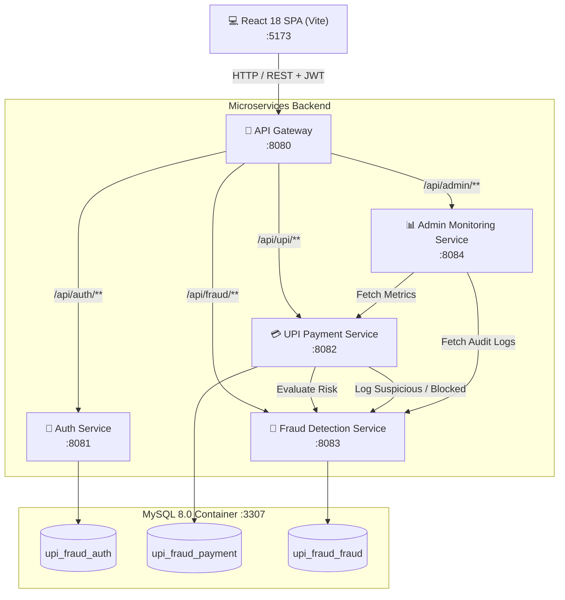

# 🛡️ Real-Time UPI Fraud Detection & Dynamic Risk Scoring Microservices Engine

[](https://www.oracle.com/java/)
[](https://spring.io/projects/spring-boot)
[](https://spring.io/projects/spring-cloud-gateway)
[](https://reactjs.org/)
[](https://vitejs.dev/)
[](https://www.mysql.com/)
[](https://www.docker.com/)

An enterprise-grade, distributed microservices ecosystem that simulates Unified Payments Interface (UPI) transactions and performs real-time cybersecurity evaluation, behavioral analysis, and dynamic risk scoring before debiting user balances.

---

## 📑 Table of Contents

- [Overview](#-overview)
- [System Architecture](#-system-architecture)
- [Microservices Breakdown](#-microservices-breakdown)
- [Multi-Layered Fraud Detection Engine](#-multi-layered-fraud-detection-engine)
- [Security & Resilience Features](#-security--resilience-features)
- [Database Schema](#-database-schema)
- [API Reference](#-api-reference)
- [Getting Started](#-getting-started)
  - [Prerequisites](#prerequisites)
  - [1. Database Setup (Docker)](#1-database-setup-docker)
  - [2. Build Services](#2-build-services)
  - [3. Start Microservices](#3-start-microservices)
  - [4. Launch Frontend](#4-launch-frontend)
- [Default Credentials & Demo Accounts](#-default-credentials--demo-accounts)
- [Fraud Simulation & Testing Scenarios](#-fraud-simulation--testing-scenarios)
- [Project Structure](#-project-structure)

---

## 🔍 Overview

UPI (Unified Payments Interface) transactions demand sub-second latency and high security. This project implements a high-throughput, rule-based fraud scoring pipeline with multi-layered cyber defense mechanisms, evaluating transaction parameters against behavioral patterns, geospatial telemetry, hardware fingerprints, and frequency anomalies.

### Key Highlights:
- **Instant Risk Scoring:** Calculates composite risk points in milliseconds.
- **Automated Decision Engine:** Dynamically resolves to `APPROVE`, `SUSPICIOUS`, or `BLOCK`.
- **Geospatial Velocity Analysis (Impossible Travel):** Calculates Haversine great-circle distance vs. elapsed time to prevent Account Takeovers (ATO).
- **Cryptographic Device Fingerprinting:** Uses SHA-256 hardware/browser profiling to prevent device ID spoofing.
- **UEBA (User & Entity Behavior Analytics):** Profiles time-of-day habits to flag off-hour anomalies.
- **Idempotency Key Protection:** Protects against accidental double-clicks and network retry duplicates.
- **Comprehensive Admin Observability:** Dedicated real-time monitoring dashboard for security analysts.

---

## 🏗️ System Architecture



---

## 🧩 Microservices Breakdown

| Service | Port | Database | Primary Responsibilities |
| :--- | :--- | :--- | :--- |
| **API Gateway** | `8080` | None | Unified routing, reverse proxy, request dispatching. |
| **Auth Service** | `8081` | `upi_fraud_auth` | User registration, authentication, BCrypt hashing, JWT issuance, brute-force lockout. |
| **UPI Payment Service** | `8082` | `upi_fraud_payment` | Account balance management, idempotency handling, transaction orchestration, history. |
| **Fraud Detection Service** | `8083` | `upi_fraud_fraud` | Real-time 8-layer rule evaluation, risk score aggregation, decision engine, fraud logging. |
| **Admin Monitoring Service** | `8084` | None (Aggregator) | Admin dashboard metrics, fraud alert audits, flagged transaction analysis. |
| **Frontend Web App** | `5173` | Browser Storage | Interactive dashboard, payment initiation, geolocation & device fingerprint capture, admin UI. |

---

## 🛡️ Multi-Layered Fraud Detection Engine

Each incoming payment request is evaluated against 8 distinct cybersecurity rules. Points are aggregated into a composite score:

### 1. Detection Rules & Risk Points

| Rule Name | Trigger Condition | Risk Points | Cybersecurity Value |
| :--- | :--- | :---: | :--- |
| **Impossible Travel** | Required speed between current & previous GPS coordinates $> 1200\text{ km/h}$ (Haversine formula). | **100** | **Critical:** Detects Account Takeover (ATO) & geo-spoofing across impossible physical distances. |
| **Device Spoofing** | Same `deviceId` sent with a different SHA-256 browser/hardware fingerprint. | **40** | **Identity:** Detects forged device headers and browser cloning attacks. |
| **Failed PIN Attempts** | Recent failed PIN attempts $\ge 3$. | **40** | **Brute-Force:** Prevents credential stuffing and PIN guessing. |
| **Rapid Transactions** | $\ge 3$ transactions executed within a 60-second rolling window. | **30** | **Velocity:** Prevents automated bot drain attacks and rapid money laundering. |
| **Amount Spike** | Transaction amount $> 5\times$ user's historical rolling average. | **25** | **Anomaly:** Flags abnormal high-value drains and anomalous transfers. |
| **Unusual Time (UEBA)** | Transaction occurs outside the user's typical active hour window ($\pm 2\text{h}$ buffer). | **25** | **Behavioral:** Flags sleeper account activation and late-night unauthorized activity. |
| **New Device** | `deviceId` has never been associated with this account. | **20** | **Access:** Alerts on unfamiliar endpoint devices. |
| **IP Change** | Client IP address differs from recent transaction history. | **15** | **Network:** Detects sudden proxy/VPN hops or network location changes. |

### 2. Decision Matrix

$$\text{Total Risk Score} = \sum \text{Triggered Rule Points}$$

```
   0                     30                     60                    100+
   ├──────────────────────┼──────────────────────┼──────────────────────┤
   │     🟢 LOW RISK      │    🟡 MEDIUM RISK    │     🔴 HIGH RISK     │
   │       (0 - 30)       │      (31 - 60)       │        (61+)         │
   │      == APPROVE ==   │    == SUSPICIOUS ==  │      == BLOCK ==     │
   │  Balance debited,    │  Balance debited,    │  Debit rejected,     │
   │  completed normally. │  flagged for review. │  prevented fraud.    │
```

---

## 🔒 Security & Resilience Features

- **Idempotency Key:** Protects payment endpoints against network retries and double debiting (`409 Conflict` on duplicate key).
- **JWT Authentication:** Stateless, signed tokens using HMAC-SHA256 (`HS256`) validated across services.
- **Account Lockout Protection:** Auto-locks accounts for 30 minutes after 5 consecutive failed login attempts.
- **BCrypt Password Hashing:** Salted, adaptive one-way hashing for secure credential persistence.
- **Client Fingerprinting:** Automated client-side collection of hardware traits (User Agent, screen resolution, timezone, language) hashed via SHA-256 on the backend.

---

## 🗄️ Database Schema

### 1. `upi_fraud_auth`
- `users`: `id (PK)`, `name`, `upi_id (Unique)`, `password`, `role (USER/ADMIN)`, `account_status`, `failed_login_attempts`, `locked_until`, `created_at`

### 2. `upi_fraud_payment`
- `accounts`: `id (PK)`, `user_id (Unique)`, `upi_id`, `balance`, `created_at`
- `upi_transactions`: `id (PK)`, `user_id`, `receiver_upi_id`, `amount`, `status (PENDING, SUCCESS, SUSPICIOUS, BLOCKED, FAILED)`, `ip_address`, `device_id`, `device_fingerprint`, `latitude`, `longitude`, `risk_score`, `idempotency_key (Unique)`, `created_at`

### 3. `upi_fraud_fraud`
- `fraud_logs`: `id (PK)`, `transaction_id`, `user_id`, `fraud_reason`, `risk_points`, `total_risk_score`, `flagged_at`

---

## 📡 API Reference

All requests route through the **API Gateway** on `http://localhost:8080`.

### Authentication Endpoints (`/api/auth`)
| Method | Endpoint | Description | Auth Required |
| :--- | :--- | :--- | :---: |
| `POST` | `/api/auth/register` | Register new user account | ❌ |
| `POST` | `/api/auth/login` | Login and receive Bearer JWT | ❌ |

### Payment Endpoints (`/api/upi`)
| Method | Endpoint | Description | Auth Required |
| :--- | :--- | :--- | :---: |
| `GET` | `/api/upi/balance` | Retrieve current account balance | ✅ Bearer |
| `POST` | `/api/upi/pay` | Initiate a UPI payment with telemetry | ✅ Bearer |
| `GET` | `/api/upi/history` | Paginated transaction history | ✅ Bearer |

#### Sample Payment Request Payload (`POST /api/upi/pay`):
```json
{
  "receiverUpiId": "merchant@hdfc",
  "amount": 2500.00,
  "deviceId": "dev-macbook-pro-01",
  "deviceFingerprintInput": "Mozilla/5.0...|1920x1080|Asia/Kolkata|en-US",
  "latitude": 28.6139,
  "longitude": 77.2090,
  "idempotencyKey": "9b1deb4d-3b7d-4bad-9bdd-2b0d7b3dcb6d"
}
```

### Admin Monitoring Endpoints (`/api/admin`)
| Method | Endpoint | Description | Auth Required |
| :--- | :--- | :--- | :---: |
| `GET` | `/api/admin/dashboard` | Aggregated fraud and payment stats | ✅ Admin JWT |
| `GET` | `/api/admin/fraud-logs` | List of all flagged / blocked fraud logs | ✅ Admin JWT |

---

## 🚀 Getting Started

### Prerequisites
- **Java 17+** (OpenJDK / Oracle JDK)
- **Maven 3.8+**
- **Node.js 18+** & **npm**
- **Docker & Docker Compose** (for MySQL)

---

### 1. Database Setup (Docker)

Start the MySQL 8.0 container on port `3307`:

```bash
docker-compose up -d
```

> **Note:** The databases (`upi_fraud_auth`, `upi_fraud_payment`, `upi_fraud_fraud`) are created automatically on service startup with `createDatabaseIfNotExists=true`.

---

### 2. Build Services

Build all microservice modules from the project root:

```bash
mvn clean install -DskipTests
```

---

### 3. Start Microservices

Launch each service in separate terminal windows:

```bash
# Terminal 1: Auth Service (Port 8081)
cd auth-service && mvn spring-boot:run

# Terminal 2: Fraud Detection Service (Port 8083)
cd fraud-detection-service && mvn spring-boot:run

# Terminal 3: UPI Payment Service (Port 8082)
cd upi-payment-service && mvn spring-boot:run

# Terminal 4: Admin Monitoring Service (Port 8084)
cd admin-monitoring-service && mvn spring-boot:run

# Terminal 5: API Gateway (Port 8080)
cd api-gateway && mvn spring-boot:run
```

---

### 4. Launch Frontend

In a new terminal window:

```bash
cd frontend
npm install
npm run dev
```

Visit the application at: **`http://localhost:5173`**

---

## 👤 Default Credentials & Demo Accounts

| Role | UPI ID / Username | Password | Notes |
| :--- | :--- | :--- | :--- |
| **Admin** | `admin@upi` | `admin123` | Seeded automatically; accesses Admin Monitoring UI. |
| **User** | Register via UI | Your Password | Automatically credited with a **₹10,000.00** demo balance. |

---

## 🧪 Fraud Simulation & Testing Scenarios

You can verify the multi-layered fraud engine directly via the UI or API:

### 1. Normal Payment (Low Risk)
- Transfer ₹500 from your regular browser.
- **Expected:** Risk Score `0`, Status `SUCCESS` (Approved).

### 2. Amount Spike Anomaly (Medium Risk)
- After making small ₹100 payments, initiate a payment of ₹6,000 (>5x average).
- **Expected:** Amount Spike triggered (+25 pts) → Status `SUSPICIOUS`.

### 3. Impossible Travel Attack (High Risk - ATO Block)
- Send a transaction with coordinates for Delhi (`28.6139, 77.2090`).
- Immediately send another transaction with coordinates for London (`51.5074, -0.1278`).
- **Expected:** Impossible Travel triggered (+100 pts) → Status `BLOCKED` (Debit rejected).

### 4. Device Spoofing Attack
- Retain the same `deviceId` string but alter user-agent or browser characteristics.
- **Expected:** Device Spoofing triggered (+40 pts) → Status `SUSPICIOUS` or `BLOCKED`.

### 5. Rapid Velocity Drain
- Click send 3 or more times in under 60 seconds.
- **Expected:** Rapid Transactions triggered (+30 pts).

### 6. Idempotency Duplicate Protection
- Send two requests with the identical `idempotencyKey`.
- **Expected:** First request succeeds; second request returns `409 Conflict` (`Duplicate transaction. Idempotency key already used.`).

---

## 📂 Project Structure

```
UPI_FRAUD_DETECTION/
├── api-gateway/                 # Spring Cloud API Gateway (Port 8080)
├── auth-service/                # Authentication & User Management (Port 8081)
├── upi-payment-service/         # UPI Transactions & Balances (Port 8082)
├── fraud-detection-service/     # Rule Engine & Risk Scoring (Port 8083)
├── admin-monitoring-service/    # Admin Aggregation & Audits (Port 8084)
├── frontend/                    # React 18 + Vite Web Application
├── docker-compose.yml           # MySQL 8.0 Container Configuration
├── pom.xml                      # Parent Maven Project Configuration
├── FULL_APP.md                  # Comprehensive Architecture Spec
├── PAYMENT.md                   # Payment & Fraud Engine Documentation
└── README.md                    # Project Readme & Getting Started Guide
```

---

## 📜 License & Acknowledgments

Developed as a semester project for academic and security demonstration purposes. Built with Spring Boot, React, and MySQL.
